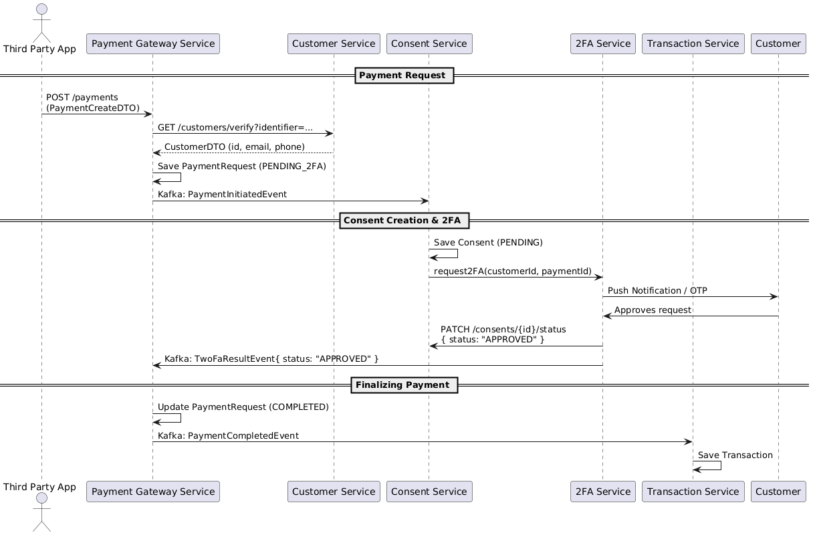

# 💳 EFT Payment Microservices System

This project is a simulation of a payment authorization and processing system, modeled after Banks (Application Supported by Blocked Amount) patterns used in financial services.

Built using **Java 21**, **Spring Boot**, **Gradle**, and **Apache Kafka**, it demonstrates a modern **event-driven microservice architecture** with secure, decoupled communication between services.

**Key Features Demonstrated:**

* Initiating payments via a **Payment Gateway Service**.
* Verifying customer identity using various identifiers (email, phone, RSA ID) through the **Customer Service**.
* Managing payment consent and triggering two-factor authentication (2FA) with the **Consent Service**.
* Handling OTP/push notification-based 2FA through the **2FA Service**.
* Recording and managing finalized transactions with the **Transaction Service**.
* Asynchronous communication between services using **Apache Kafka**.
* Querying transaction history for customers.

---

## 🧱 Microservices Overview

| Service | Description                                                                         |
|--------|-------------------------------------------------------------------------------------|
| **Payment Gateway Service** | Entry point for third-party apps to initiate payments. Handles orchestration.       |
| **Customer Service** | Verifies customer identity based on identifier (e.g. email, phone, ID number(RSA)). |
| **Consent Service** | Manages consent records and initiates 2FA for payment approval.                     |
| **2FA Service** | Sends OTP or push notification to user and handles 2FA responses.                   |
| **Transaction Service** | Records finalized transactions for audit and history queries.                       |

---

## 🔁 Flow Summary

1. A **third-party app** submits a payment request.
2. **Customer Service** verifies the customer's identity.
3. A **Consent** is created and a **2FA** challenge is triggered.
4. On successful 2FA approval, the payment is **finalized** and a transaction is recorded.
5. The third party can later **query transaction history** for a customer.

> Kafka is used to pass events between services asynchronously.

---

## 📊 Architecture Diagram

---

## 📄 License

The code in this repository is licensed under the **MIT License**.

Please see the `LICENSE` file in the root of this repository for more details.# Pay-eft
